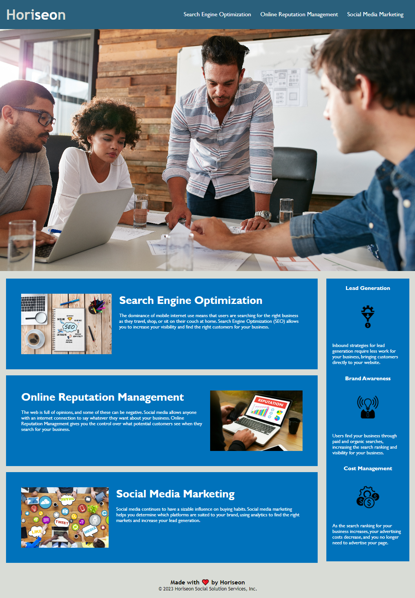

# Horiseon HTML & CSS refactor

## Updated items
* Added descriptive alt statments for each image and icon
* Changed some of the generic tags to tags that are more closely related to the element
* Fixed broken link for Search Engine Optimization
* Changed the title to something more descriptive
* Update background color of "benefit" section to match background color of cards
*  Added favicon
* Combined css classes that used the same values

### The resulting web page is more effecient and has the same appearance

